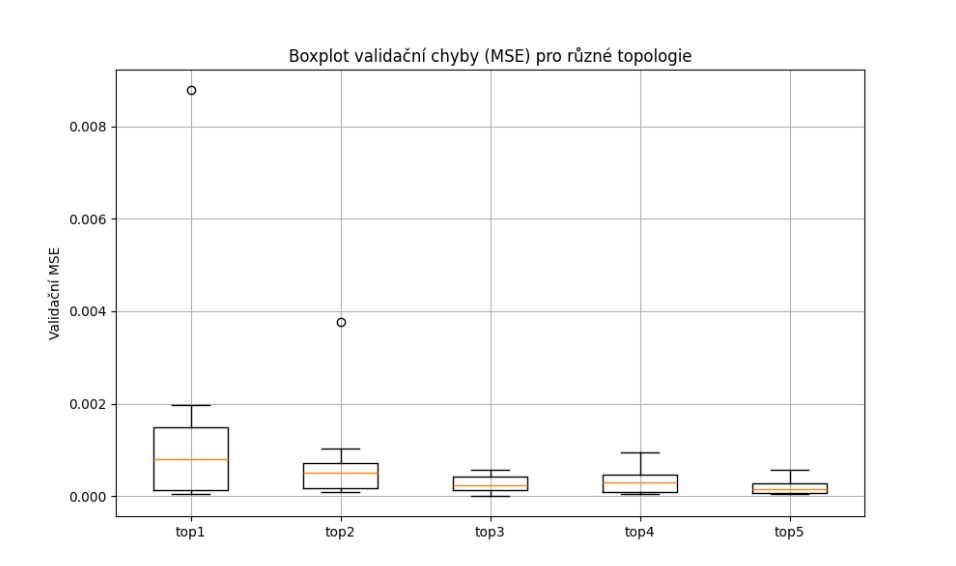

# Experiment 03: Porovnání přesnosti různých topologií neuronové sítě

## Popis úlohy
Cílem tohoto experimentu bylo porovnat výkon různých topologií dopředné neuronové sítě (FFNN) při predikci výstupu dynamického systému. Model byl trénován s využitím časově posunutých vstupů `u(k), u(k-1), y(k-1), y(k-2)` a cílem bylo predikovat `y(k)`.

Každá topologie byla natrénována 10× a hodnocena pomocí validační chyby (val_loss).

Testované topologie:
- [8]
- [16]
- [32]
- [16, 8]
- [32, 16]

## Parametry trénování
- **Počet epoch:** 100
- **Optimalizátor:** Adam
- **Aktivační funkce:** ReLU
- **Ztrátová funkce:** MSE
- **Velikost batch:** 32
- **Počet opakování:** 10 pro každou topologii
- **Validace:** 20 % validačních dat z trénovací množiny

## Shrnutí výsledků
Výsledky byly vizualizovány pomocí boxplotu, který ukazuje rozptyl validační chyby (`val_loss`) napříč jednotlivými opakováními pro každou testovanou topologii.

## Závěr
Topologie **[32, 16]** dosáhla nejnižší průměrné validační chyby **0.00022**, což z ní činí nejlepší model z hlediska predikční přesnosti.

Tento nejlepší model byl následně vyhodnocen na testovacích datech a dosáhl **MSE = 0.0052**, což potvrzuje jeho vysokou generalizační schopnost.

---
